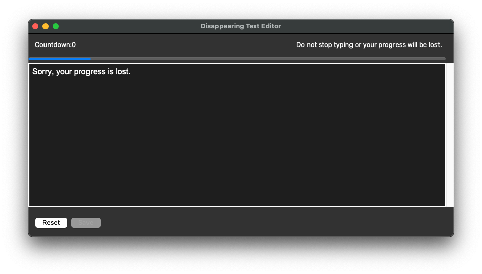
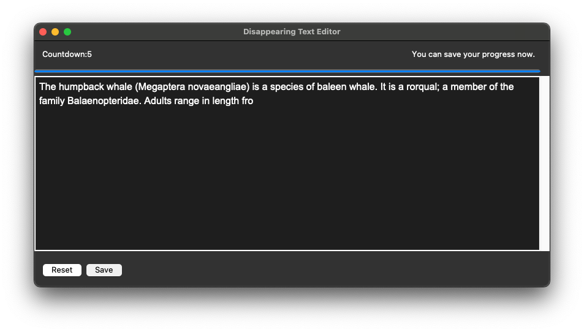

# py08_DisappearingText

Homework for *100 Days of Code: The Complete Python Pro Bootcamp for 2022*

A text editor where if you stop writing, all your progress will be lost. This application imitates the functionality of
https://www.squibler.io/dangerous-writing-prompt-app

* If user idles for 5 secs (IDLE_SECS), the text editor will clear all the text and disable ui.
* If user types for 1 min (TYPING_SECS), the save button will be enabled then user can save the progress.

### Reference

* [TkDocs Tutorial - Text](https://tkdocs.com/tutorial/text.html)
* Previous lessons in *100 Days of Code: The Complete Python Pro Bootcamp for 2022*

